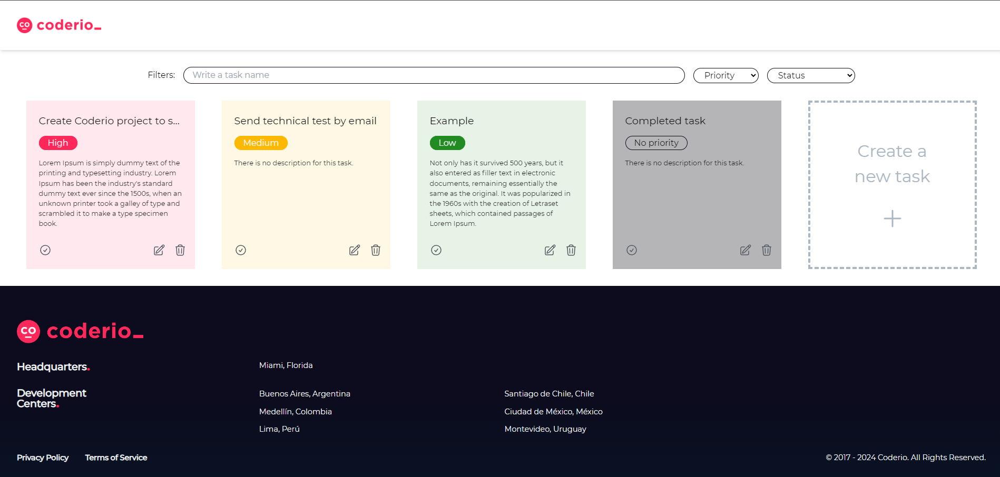

</img>

# Coderio To-Do List Website

<b>Repo for Coderio Frontend and Backend Development</b>

<a target="_blank" href="">
    Click here to see the video explanation
</a>

# How to Execute the Entire Project?

1. Clone this repo with "git clone"
2. For frontend, open a command line, execute "npm install" and then "ng serve", now you can see it on http://localhost:4200
3. For backend, open the project on IntelliJ IDEA and execute the main file "InterviewApplication.java", now you can see the documentation on http://localhost:8080/swagger-ui/index.html

# Technologies

Frontend:
<ul>
    <li>HTML</li>
    <li>CSS</li>
    <li>TypeScript (JavaScript)</li>
    <li>Angular 18+</li>
    <li>Tailwind CSS</li>
</ul>

Backend:
<ul>
    <li>Java 22</li>
    <li>Spring Boot 3</li>
    <li>H2 Database</li>
    <li>JDBC</li>
    <li>JPA</li>
    <li>Lombok</li>
    <li>Hibernate</li>
    <li>Swagger (OpenAPI) Documentation</li>
</ul>

Other:
<ul>
    <li>Visual Studio Code</li>
    <li>IntelliJ IDEA</li>
    <li>Git</li
</ul>

</img>
